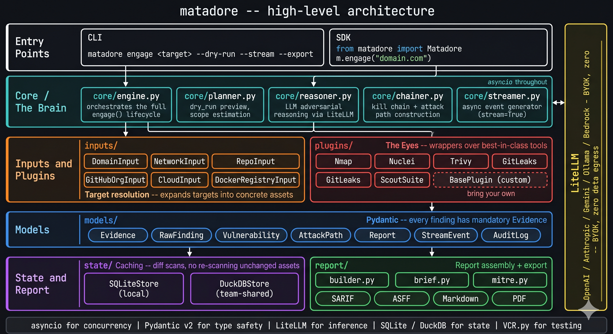
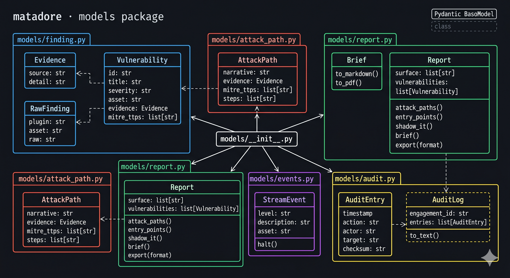

# matadore


**AI-powered attack surface mapping for red teams.**

Matadore thinks like an attacker. Point it at your infrastructure - domains, IPs, repos, cloud configs, registries - and it maps your exposed surface, chains vulnerabilities into realistic kill chains, and tells you exactly how an adversary would get in.

Built for red teams and security engineers who want adversarial reasoning, not just a checklist.



* **GitHub:** https://github.com/dariomory/matadore/
* **PyPI package:** https://pypi.org/project/matadore/
* **Created by:** **[Dario Mory](https://mory.dev)** · [GitHub](https://github.com/dariomory) · [PyPI](https://pypi.org/user/dariomory/)

```bash
pip install matadore
```

---

## Responsible use

**Disclaimer:** Matadore does **not** verify that you are allowed to scan any target. Use it only against systems and data you **own** or have **explicit written authorization** to test (for example a signed scope of work, pentest letter, or internal red-team charter). Unauthorized access to computer systems and networks is illegal in many jurisdictions and may result in civil liability. **You are solely responsible** for your use of this software and for complying with applicable laws and your organization's policies.

---

## The Problem

Security scanners give you a list. Matadore gives you a story.

| Without Matadore | With Matadore |
|---|---|
| List of CVEs | Chained attack paths |
| Scanner output | Adversarial reasoning |
| Generic risk score | *"Here's how they'd get in"* |
| Manual red team prep | AI-assisted threat modelling |
| One-shot reports | Continuous diff scanning |
| Standalone tool | Native CI/CD integration |

---

## Quick Start

Matadore uses [LiteLLM](https://github.com/BerriAI/litellm) for inference - bring your own key for any supported provider. Your data never touches Matadore's servers.

```python
from matadore import Matadore

# OpenAI
m = Matadore(
    model="gpt-4o",
    api_key="sk-...",                            # or set OPENAI_API_KEY in env
)

# Anthropic
m = Matadore(
    model="claude-opus-4-5",
    api_key="sk-ant-...",                        # or set ANTHROPIC_API_KEY in env
)

# Local model - zero data egress, no API key needed
m = Matadore(
    model="ollama/llama3",
)

report = m.engage("mydomain.com")
print(report.summary())
```

See [Responsible use](#responsible-use).

---

## Supported Models

Any model string that [LiteLLM](https://docs.litellm.ai/docs/providers) recognises works out of the box. The provider is inferred automatically from the prefix.

| Provider | Example model string | API key env var |
|---|---|---|
| OpenAI | `gpt-4o`, `gpt-4o-mini` | `OPENAI_API_KEY` |
| Anthropic | `claude-opus-4-5`, `claude-sonnet-4-5` | `ANTHROPIC_API_KEY` |
| Google Gemini | `gemini/gemini-2.0-flash` | `GEMINI_API_KEY` |
| Mistral | `mistral/mistral-large-latest` | `MISTRAL_API_KEY` |
| AWS Bedrock | `bedrock/anthropic.claude-3-5-sonnet` | AWS credentials |
| Azure OpenAI | `azure/gpt-4o` + `base_url=` | `AZURE_API_KEY` |
| Ollama (local) | `ollama/llama3`, `ollama/mistral` | *(none)* |

Pass the key as `api_key=` or export the environment variable - Matadore never requires you to manage credentials on its behalf.

---

## Attack Surface Inputs

```python
# Domains and subdomains
m.engage("mydomain.com",        type="domain")

# Network ranges
m.engage("192.168.1.0/24",      type="network")

# Source code and commit history
m.engage("myorg/myrepo",        type="repo")

# Entire GitHub org - public repos, secrets in history, exposed keys
m.engage("myorg",               type="github_org")

# Cloud configuration drift and IAM over-permissioning
m.engage("my-aws-account",      type="cloud", provider="aws")
m.engage("my-gcp-project",      type="cloud", provider="gcp")

# Docker registry - images with embedded credentials
m.engage("myorg/myimage",       type="docker_registry")
```

---

## Core Usage

### Dry-Run First

Before any active scanning, see exactly what Matadore will touch:

```python
plan = m.engage("mydomain.com", dry_run=True)
plan.show()
# Output:
# [DOMAIN]   Will resolve and enumerate: mydomain.com + 14 discovered subdomains
# [NETWORK]  Will probe: 192.168.1.12, 192.168.1.45 (skipping .0/broadcast)
# [REPO]     Will clone (read-only): myorg/myrepo @ HEAD
# [CLOUD]    Will call: ec2:DescribeInstances, s3:ListBuckets (read-only IAM)
#
# Total assets in scope: 31
# Estimated duration: ~4 min (active mode)
# Run m.engage("mydomain.com") to proceed.
```

`dry_run=True` prevents accidental self-DoS, IDS triggering, or scanning assets outside your authorized scope.

### Map the Attack Surface

```python
report = m.engage("mydomain.com")

report.surface                     # all exposed assets
report.vulnerabilities             # findings ranked by exploitability
report.entry_points()              # most likely initial access vectors
report.shadow_it()                 # assets you didn't know were public
```

The `shadow_it()` view is often the most valuable output - surfacing dev servers, staging environments, and forgotten S3 buckets that your team didn't know were exposed.

### Chain Vulnerabilities into Attack Paths

```python
# Full adversarial kill chain
report.attack_paths()

# What gets hit first, and why
report.what_would_they_hit_first()
```

Every finding includes an `evidence` field - the exact port response, code line, or API response that substantiates the claim. Matadore never asserts a path it cannot reference.

```python
for path in report.attack_paths():
    print(path.narrative)   # human-readable kill chain
    print(path.evidence)    # source data: line of code, packet capture, API response
    print(path.mitre_ttps)  # mapped ATT&CK techniques
```

### Live Streaming Mode

```python
# Findings stream in real-time as recon runs
for event in m.engage("mydomain.com", stream=True):
    print(f"[{event.level}] {event.description}")
    # [CRITICAL] Exposed .env file at https://api.mydomain.com/.env
    # [HIGH]     SSH key found in commit a3f91c (myorg/infra-repo)
    # [INFO]     Subdomain discovered: staging.mydomain.com

    # Stop if a sensitive asset appears
    if "prod-db" in event.asset:
        event.halt()
```

### Generate a Red Team Brief

```python
brief = report.brief()
brief.to_markdown()
brief.to_pdf()
```

Example output:

> *"An attacker would likely begin with the exposed Jenkins instance (CVE-2024-23897), extract the AWS access key embedded in build logs, assume an over-permissioned IAM role, pivot to S3, and exfiltrate the customer database - estimated time to impact: under 4 hours."*

### Diff Mode - Track What Changed

```python
report = m.engage("mydomain.com").diff(since="last_week")
report = m.engage("mydomain.com").diff(since="2026-04-01")
report = m.engage("mydomain.com").diff(baseline=previous_report)
```

Matadore caches engagement state locally (SQLite) so repeated scans only re-process assets that have changed. Large infrastructure scans don't start from zero.

---

## CLI

Red teams live in the terminal. The CLI uses [Rich](https://github.com/Textualize/rich) for colour-coded output, live progress bars, and interactive tables.

```bash
# Full engagement
matadore engage mydomain.com

# Dry-run preview
matadore engage mydomain.com --dry-run

# Live stream findings
matadore engage mydomain.com --stream

# Diff since last scan
matadore engage mydomain.com --diff

# Export report
matadore engage mydomain.com --export sarif --out results.sarif
matadore engage mydomain.com --export pdf   --out brief.pdf
```

The web UI (if running) is a **read-only management dashboard** - for sharing findings with stakeholders. All actions and scans live in the SDK and CLI.

---

## CI/CD Integration

```python
report = m.engage(os.environ["DEPLOY_DOMAIN"])

# Fail the pipeline on new critical findings
report.assert_no_new_criticals()

# SARIF → GitHub Security tab
report.export("sarif", path="matadore-results.sarif")

# JSON-ASFF → AWS Security Hub / Jira / Splunk
report.export("asff", path="matadore-results.asff.json")
```

**GitHub Actions example:**

```yaml
- name: Matadore attack surface scan
  env:
    OPENAI_API_KEY: ${{ secrets.OPENAI_API_KEY }}   # or ANTHROPIC_API_KEY, etc.
  run: |
    python -c "
    from matadore import Matadore
    m = Matadore(model='gpt-4o')
    report = m.engage('${{ vars.DEPLOY_DOMAIN }}')
    report.export('sarif', path='results.sarif')
    report.assert_no_new_criticals()
    "

- name: Upload to GitHub Security
  uses: github/codeql-action/upload-sarif@v3
  with:
    sarif_file: results.sarif
```

---

## Report Object

```python
report.surface                     # all exposed assets
report.vulnerabilities             # findings ranked by exploitability, with evidence
report.attack_paths()              # chained exploit sequences
report.entry_points()              # most likely initial access vectors
report.shadow_it()                 # assets not in your known inventory
report.what_would_they_hit_first() # adversary priority model
report.brief()                     # narrative red team report
report.mitre_mapping()             # findings mapped to ATT&CK tactics/techniques
report.remediation_plan()          # prioritised fix list with effort estimates
report.delta(previous_report)      # regression detection across engagements
report.audit_log()                 # tamper-evident chain of custody
report.assert_no_new_criticals()   # CI/CD gate
report.export("sarif")             # SARIF - GitHub Advanced Security
report.export("asff")              # JSON-ASFF - AWS Security Hub, Splunk, Jira
report.export("markdown")          # red team brief
report.export("pdf")               # stakeholder report
```

Every `Vulnerability` and `AttackPath` object is a typed Pydantic model with a mandatory `evidence` field. The AI cannot assert a finding without a verifiable source reference.

---

## Plugin Architecture

Matadore separates orchestration from scanning:

- **Core** = The Brain - AI reasoning, path chaining, report generation
- **Plugins** = The Eyes - wrappers around existing best-in-class tools

```python
# Built-in plugins
from matadore.plugins import Nmap, Nuclei, Trivy, GitLeaks, ScoutSuite

m = Matadore(
    model="gpt-4o",
    plugins=[Nmap(), Nuclei(), Trivy(), GitLeaks()],
)
```

Write your own:

```python
from matadore.plugins import BasePlugin

class MyScanner(BasePlugin):
    def run(self, target: str) -> list[RawFinding]:
        ...
```

This means Matadore doesn't re-implement what nmap, nuclei, and trivy already do well - it reasons over their output.

---

## Scan Modes

```python
# Passive - no active probing, zero noise (default for CI)
m.engage("mydomain.com", mode="passive")

# Active - full fingerprinting and exploit chaining (default for red team)
m.engage("mydomain.com", mode="active")

# Stealth - mimics normal traffic patterns, rate-limited
m.engage("mydomain.com", mode="stealth")
```

All modes include automatic rate-limiting with smart back-off - Matadore self-throttles against GitHub APIs, cloud endpoints, and rate-limited services to avoid triggering alarms or burning API quotas.

---

## Audit trail

Engagements are designed to support an **audit log** - a record of what was scanned, when, and by whom - so you can align with your own governance (documented pentest, red-team program, or internal policy). Matadore does not replace legal review or customer authorization workflows.

```python
report.audit_log()  # chain of custody for this engagement
```

---

## Deployment

Matadore supports two deployment models:

| Mode | How it works | Best for |
|---|---|---|
| **Cloud provider key** | You supply an OpenAI / Anthropic / Gemini key; inference runs directly with that provider | Startups, small red teams, quick onboarding |
| **On-Premise (Ollama)** | Run a local model inside your network; zero data egress | Enterprise, regulated industries, classified environments |
| **Azure / Bedrock** | Use your existing cloud LLM endpoint; data stays in your VPC | Enterprises with existing cloud LLM contracts |

```bash
# On-premise - local Ollama model, no data leaves your network
docker run --rm \
  -e MATADORE_MODEL=ollama/llama3 \
  -e OLLAMA_BASE_URL=http://your-ollama-host:11434 \
  -v $(pwd)/reports:/reports \
  matadore/runner:latest \
  engage mydomain.com --export sarif --out /reports/results.sarif
```

---

## Technical Design

| Concern | Approach |
|---|---|
| **LLM inference** | [LiteLLM](https://github.com/BerriAI/litellm) - single interface over OpenAI, Anthropic, Gemini, Bedrock, Ollama, and more |
| **Type safety** | Pydantic models for all `Finding`, `AttackPath`, and `Report` objects |
| **Concurrency** | `asyncio` throughout the mapping phase - 100 IPs scan in parallel, not sequence |
| **State & caching** | SQLite (local) or DuckDB (team-shared) to avoid re-scanning unchanged assets |
| **Rate limiting** | Automatic back-off on GitHub, AWS, and GCP API endpoints |
| **Testing** | VCR.py records and replays network interactions - CI runs never consume API credits |
| **Evidence requirement** | Every `Finding` has a mandatory `evidence: Evidence` field - no unsubstantiated assertions |

### Domain Model



---

## Roadmap

- [ ] `type="slack_workspace"` - social engineering surface mapping
- [ ] `type="email_domain"` - phishing and pretexting exposure
- [ ] Azure provider support
- [ ] Attack graph visualization (Cytoscape.js) in the web dashboard
- [ ] VS Code extension - inline findings during development
- [ ] Team mode - shared org state and collaboration across engagements
- [ ] Engagement templates (external pentest, insider threat, supply chain)

## Development

To set up for local development:

```bash
# Clone your fork
git clone git@github.com:your_username/matadore.git
cd matadore

# Install in editable mode with live updates
uv tool install --editable .
```

This installs the CLI globally but with live updates - any changes you make to the source code are immediately available when you run `matadore`.

Run tests:

```bash
uv run pytest
```

Run quality checks (format, lint, type check, test):

```bash
just qa
```

---

## Author

matadore was created in 2026 by Dario Mory.

---

## License

MIT - see [LICENSE](LICENSE).

> **Legal notice:** Matadore does not check whether you are permitted to scan a target. Only scan infrastructure you own or have explicit written authorization to test. Unauthorized scanning is illegal in most jurisdictions. See [Responsible use](#responsible-use).
